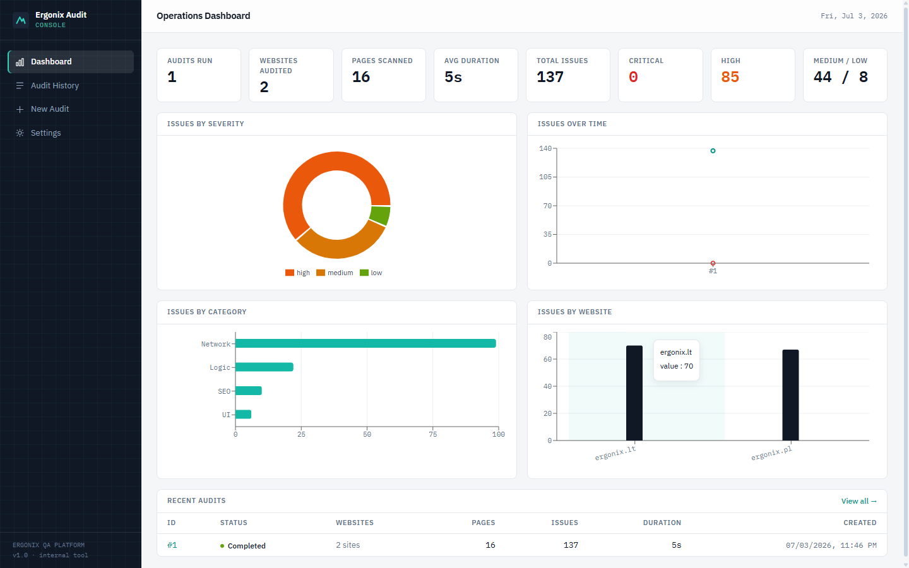
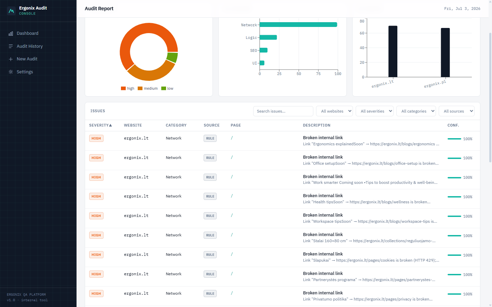
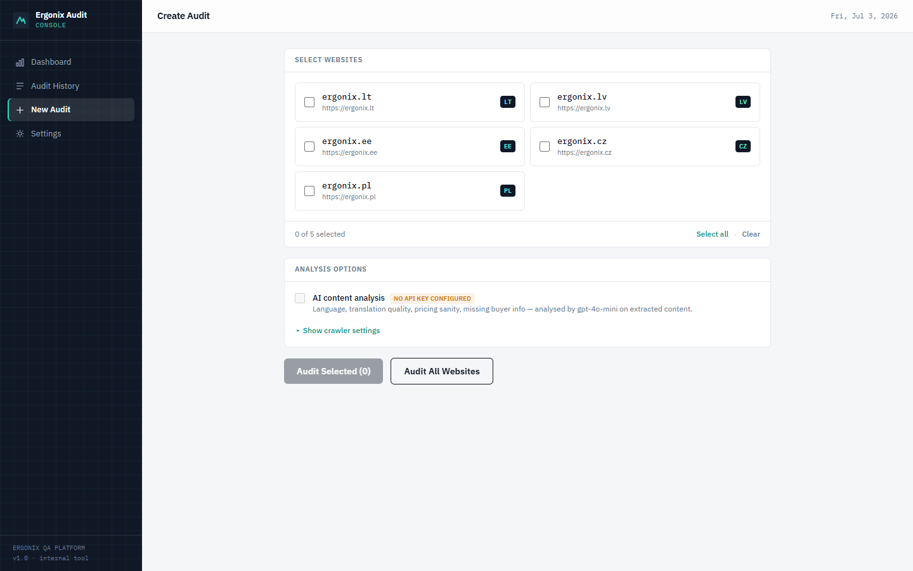

# Ergonix Website Audit Platform

Internal QA tool that automatically audits the Ergonix e-commerce storefronts
(`ergonix.lt` · `ergonix.lv` · `ergonix.ee` · `ergonix.cz` · `ergonix.pl`).
It crawls real pages, runs 20+ rule-based technical checks plus AI content
analysis, and produces filterable, exportable reports.



## What it does

- **Crawl** — polite BFS crawler follows internal links on each selected
  storefront (robots.txt respected, duplicates skipped, configurable pages /
  depth / concurrency / timeout / retries). No page content is ever entered
  manually; everything comes from live pages.
- **Rule-based checks (40+)** — broken internal/external links, 404/5xx pages,
  missing/duplicate titles and meta descriptions, missing/multiple H1, skipped
  heading levels, missing image alt, oversized images and JS/CSS bundles, images
  without dimensions (CLS), slow responses and loads, HTTP links and mixed
  content on HTTPS, hardcoded cross-country links, empty or inert buttons, forms
  without submit, redirect loops/chains and unexpected cross-domain redirects,
  console errors and failed requests (browser pass), template/Liquid errors,
  zero/wrong-currency prices, missing Open Graph / structured data / hreflang /
  favicon / viewport.
- **Security checks** — exposed sensitive files (`.git`, `.env`, DB dumps,
  phpinfo — with content validation to avoid soft-404 false positives),
  HTTP→HTTPS redirect enforcement, missing security headers (HSTS, CSP,
  clickjacking, X-Content-Type-Options, Referrer-Policy), cookies without
  Secure/SameSite, insecure form actions, reverse-tabnabbing links, third-party
  scripts without Subresource Integrity, mixed content, and server version
  disclosure.
- **AI content analysis** — structured page extracts (never raw HTML) are sent
  to an OpenAI-compatible model that judges language correctness per country,
  translation quality, placeholders, pricing sanity, missing shipping/warranty
  /buyer info, UX writing and trust issues. See [docs/AI.md](docs/AI.md).
- **Report** — merged findings with severity, category, source, suggested fix
  and confidence; dashboard charts; export as **JSON / CSV / HTML / PDF**.

| Audit report | Create audit |
|---|---|
|  |  |

*Screenshots show a real audit of ergonix.lt + ergonix.pl (137 genuine
findings, including live 404 blog links on ergonix.lt).*

## Stack

**Backend** Go · Gin · goquery crawler · Playwright (optional browser pass) ·
OpenAI-compatible LLM client · SQLite (pure-Go, no CGO) — clean architecture:
`api → audit → {crawler, browser, checks, ai, report} → models`.

**Frontend** React 18 · TypeScript · Vite · Tailwind v4 · TanStack Query ·
TanStack Table · Recharts.

## Automatic scheduled audits (built in)

The platform can audit the sites **on its own**, with no manual trigger. Set
these and restart the backend:

```bash
SCHEDULE_ENABLED=true
SCHEDULE_INTERVAL_HOURS=24     # audit every 24h
SCHEDULE_AT_START=true        # also run once ~5s after boot
```

These can also be set **from the Settings page in the UI** (no restart) — the
scheduler is reconfigured live, and the AI API key / model / base URL are
editable there too (the key is stored server-side and never shown again).
DB-stored settings override the `.env` defaults.

Scheduled audits are tagged **auto** in the history, survive restarts (a due
run isn't skipped), and each run is compared against the previous audit of the
same sites. The audit report then shows a **"Change since audit #N"** panel —
new issues (with a `NEW` badge in the table), resolved issues, and a
severity breakdown — so you see regressions the moment they appear rather than
re-reading the whole list. This change analysis works for manual audits too.

## Fully automatic checks (no UI needed)

The `audit` CLI runs the entire pipeline — crawl real pages → rule checks →
AI analysis → report — from a single command:

```bash
cd backend

# check one site, print the problem list, write json+html reports
go run ./cmd/audit -sites https://ergonix.lt -pages 20

# check every configured storefront, all four report formats
go run ./cmd/audit -sites all -formats json,csv,html,pdf -out ./reports

# keep checking automatically every 24 hours
go run ./cmd/audit -sites all -interval 24h

# CI quality gate: exit code 2 when high/critical issues exist
go run ./cmd/audit -sites all -fail-on high
```

Sample output:

```
[https://ergonix.lt] crawl  6 pages fetched
[https://ergonix.lt] checks 29 findings

================ ERGONIX WEBSITE AUDIT ================
Status: completed   Websites: 1  Pages: 6  Duration: 27s
Issues: 29  (critical 0 · high 5 · medium 20 · low 4)
=======================================================

[HIGH] Network · rule · https://ergonix.lt/
  Broken internal link
  Link "Ergonomics explained" → https://ergonix.lt/blogs/ergonomics is broken (HTTP 404)
  fix: Fix the target URL, restore the destination page, or remove the link.
…
report written: reports/ergonix-audit-20260704-000359.json
report written: reports/ergonix-audit-20260704-000359.html
```

For unattended scheduled runs use `-interval`, or wire the one-shot form into
cron / Windows Task Scheduler / CI:

```
# cron: full audit of all storefronts every night at 03:00
0 3 * * *  cd /opt/ergonix-audit/backend && ./audit -sites all -quiet -out /var/reports
```

## Quick start (Docker)

```bash
cp .env.example .env          # optionally set OPENAI_API_KEY for AI checks
docker compose up --build
```

Open **http://localhost:3000** — nginx serves the SPA and proxies `/api` to
the backend; audit data persists in the `audit-data` volume.

## Quick start (local dev)

Prerequisites: Go ≥ 1.24, Node ≥ 20.

```bash
# Terminal 1 — backend on :8080
cd backend
go run ./cmd/server

# Terminal 2 — frontend on :5173 (proxies /api to :8080)
cd frontend
npm install
npm run dev
```

Open **http://localhost:5173**, pick websites, press **Audit Selected** (or
**Audit All Websites**) and watch the pipeline run.

Optional extras:

```bash
# enable AI analysis
echo OPENAI_API_KEY=sk-... >> .env       # or any OpenAI-compatible endpoint

# enable the real-browser pass (console errors, failed requests, load timing)
npx playwright install chromium
echo BROWSER_ENABLED=true >> .env
```

## Tests

```bash
cd backend && go test ./...
```

Covers the crawler (BFS, dedup, depth/pages caps, robots.txt, redirect loops,
cancellation — against local httptest sites), every rule check (fires on bad
fixtures, silent on good ones), AI response parsing and failure tolerance,
all four exporters, the SQLite store, and a full end-to-end API lifecycle
(create → poll → issues → filters → exports → delete).

```bash
cd frontend && npm run build   # tsc type-check + production build
```

## Configuration

Everything is driven by environment variables (`.env` supported) —
see [.env.example](.env.example) for the complete annotated list. Highlights:

| Variable | Default | Meaning |
|---|---|---|
| `WEBSITES` | the 5 Ergonix stores | registry shown in the UI |
| `OPENAI_API_KEY` | *(empty — AI off)* | any OpenAI-compatible key |
| `OPENAI_BASE_URL` | `https://api.openai.com/v1` | swap for Azure/OpenRouter/Ollama |
| `AI_MAX_PAGES_PER_SITE` | `8` | cost cap; richest pages analysed first |
| `BROWSER_ENABLED` | `false` | Playwright pass on/off |
| `RESPECT_ROBOTS` | `true` | robots.txt compliance |
| `CRAWL_DELAY_MS` | `250` | per-request politeness delay |
| `CHECK_*` | see file | thresholds for size/speed checks |

## Project layout

```
backend/
  cmd/server/          entrypoint, wiring, graceful shutdown
  internal/
    api/               Gin router, handlers, CORS/logging middleware
    audit/             pipeline orchestrator (crawl→check→AI→merge→save)
    crawler/           BFS crawler, robots.txt, URL utils, page extraction
    browser/           Playwright service + noop fallback
    checks/            19 page checks + 3 site checks + link prober
    ai/                summaries, prompt, OpenAI client, strict-JSON parser
    report/            JSON / CSV / HTML / PDF exporters
    database/          SQLite store (pure Go), migrations, repositories
    models/            domain types shared by every layer
    config/            env-driven configuration
frontend/
  src/
    api/  hooks/  types/        typed client + TanStack Query hooks
    components/  charts/        badges, panels, issues table, Recharts
    layouts/  pages/            console shell + 5 pages
docs/
  API.md               REST reference
  AI.md                how AI is used (and kept cheap/safe)
  examples/            real audit report exports (json/csv/html/pdf)
  screenshots/         README images
```

## Design notes

- **Failure containment at every level** — a dead page becomes a 404 finding,
  a panicking check is recovered and logged, a failed AI call marks the audit
  `aiSkipped` instead of aborting it; an audit only fails when *every* site
  fails.
- **Polite by construction** — custom `ErgonixAuditBot/1.0` user agent,
  *site-wide* request pacing (the delay bounds total request rate, not
  per-worker rate), robots.txt group matching with longest-match
  Allow/Disallow, external link probes capped, page/link bodies size-limited.
  HTTP 429 is treated as "the shop throttled us", never as a broken link,
  and the crawler retries it with hard backoff.
- **Async audits, sync API** — `POST /api/audits` returns instantly; progress
  is persisted per site and the UI polls every 2 s while running, so a browser
  refresh (or backend restart) never loses a report.
- **SQLite on purpose** — zero-dependency MVP storage behind a `Store`
  interface; swapping in Postgres is a repository change, not a rewrite.

## API

Full reference in [docs/API.md](docs/API.md). At a glance:

```
POST   /api/audits                       create + start (async)
GET    /api/audits                       history
GET    /api/audits/{id}                  status / progress / stats
POST   /api/audits/{id}/cancel           stop a running audit
DELETE /api/audits/{id}                  remove audit + data
GET    /api/audits/{id}/issues           filter: website/severity/category/source/search
GET    /api/audits/{id}/pages            crawl inventory
GET    /api/audits/{id}/export/{format}  json | csv | html | pdf
GET    /api/websites · /api/dashboard · /api/settings · /healthz
```
